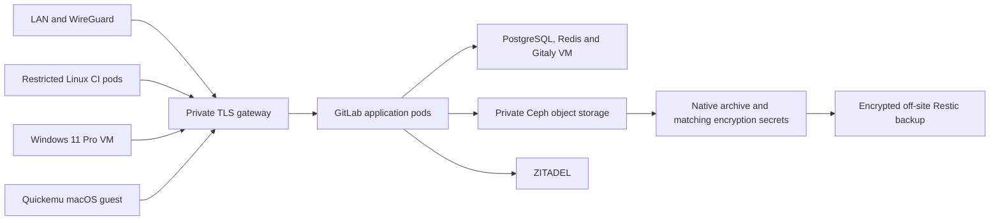

# Private GitLab on OpenStack

GitLab has its own Magnum/CAPI workload cluster, `gitlab-v1`, in the `gitlab`
OpenStack project. It does not consume nodes in `services-v1`. Flux deploys the
official GitLab EE chart, version 10.3.1 / GitLab 19.3.1, from a pinned upstream
commit. EE starts with Free features; an administrator can activate a Premium
license later without replacing the installation. No paid subscription or trial
activation token is embedded in this repository.

## Initial allocation

| Component | RAM | vCPU | Placement |
| --- | ---: | ---: | --- |
| Kubernetes control plane | 4 GiB | 2 | New Magnum cluster |
| Kubernetes worker | 12 GiB | 6 | GitLab and bounded Linux CI jobs |
| GitLab data VM | 4 GiB | 4 | Separate protected Cinder volume, initially 300 GiB |
| Windows 11 Pro runner | 12 GiB | 6 | Isolated `gitlab-ci` project |
| Quickemu runner host | 12 GiB | 6 | Qualified Intel host; 8 GiB macOS guest |

The initial GitLab allocation is 20 GiB. Both desktop runners bring the VM total
to 44 GiB, excluding spare capacity. The live inventory on 2026-09-05 had about
37 GiB available to Nova. Do not reduce the 32 GiB per-host reservation used by
the undercloud and Ceph to make these allocations fit. The runner rollout needs
additional capacity and sufficient free RAM on the particular Intel host.
Each Kubernetes node boots from an explicit 80 GiB `rbd1` Cinder volume; the
flavors do not allocate a local root disk.

This initial installation is **not highly available**: there is one control
plane, one worker and one data VM. Ceph replication protects disks but does not
keep GitLab online during a VM or worker failure. The independent cluster can be
rebuilt from signed Git, restored application secrets and native backups. Scale
the control plane, worker pool and data services deliberately when capacity is
available; do not assume that adding application replicas makes the database HA.

## Networks and identity

| Purpose | Address |
| --- | --- |
| GitLab tenant network | `192.168.82.0/24` |
| GitLab data VM | `192.168.82.10`, operator SSH at `10.21.40.128` |
| GitLab tenant router SNAT | `10.21.40.129` |
| GitLab / registry / KAS gateway | `10.21.40.127` |
| Private Ceph S3 endpoint | `gitlab-s3.cloud.fahrican.com`, `10.21.20.130` |
| Desktop runner tenant network | `192.168.81.0/24` |
| Windows 11 / Quickemu management | `10.21.40.125` / `10.21.40.126` |

`public` is OpenStack's existing **private VLAN 40 provider network**. It is not
an Internet address. There are no GitLab WAN port forwards or HTTP listeners.
Clients use `https://gitlab.fahrican.com`, `https://registry.fahrican.com` and
`https://kas.fahrican.com`; Git over SSH uses port 2222. Publicly trusted TLS
certificates use Cloudflare DNS-01 validation, which needs no public HTTPS.
WireGuard clients route VLAN 40 through the tunnel; RouterOS still limits the
allowed destination ports. Magnum allocates the private Kubernetes API floating
address; its API listener allowlist includes operators, the undercloud, CAPI
management and the GitLab tenant.

GitLab uses native ZITADEL OIDC, keeping Git, registry authentication and API
tokens usable. Newly created OIDC accounts require administrator approval;
accounts are not automatically linked by email. A security reconciliation Job
sets private visibility, disables public registration and password-based Git
access, requires 2FA and blocks local-network webhook requests **before** Flux
publishes application routes. The root password is encrypted in the bootstrap
Secret and serves as the initial break-glass login. Configure and retain 2FA
recovery codes during first login.

PostgreSQL, Redis and Gitaly require separate authentication tokens. Their ports
are reachable only from the GitLab tenant; the CI network cannot reach them.
Traffic within that isolated tenant uses the native PostgreSQL/Redis/Gitaly
protocols. TLS protects client, OIDC, SMTP and S3 connections. Registry redirects
and object download redirects are disabled, so runners never need S3 credentials
or access to the data network. Resend uses a dedicated domain-scoped sending key.

## Deployment ownership

1. `undercloud/86-gitlab-foundation` creates only GitLab/CI projects, networks,
   flavors and quotas through its own Terraform state.
2. `undercloud/86-gitlab` provisions the data VM from a signed, promoted NixOS
   image and decrypts the independent cluster bootstrap secrets.
3. Enroll backend credentials over pinned SSH using
   `components/cloud/services/gitlab/enroll.py`. The undercloud kubeconfig is
   required to read the GitLab RGW user's credentials. Restart `docker-gitlab`
   after enrollment and verify PostgreSQL, Redis and Gitaly health.
4. `undercloud/88-gitlab-cluster` creates the Magnum cluster and installs Flux,
   its own age key, the trusted Git signing key and runtime secrets. GitLab has
   an independent Flux root at this directory. Credentials use tmpfs during
   bootstrap, and the bootstrap account can read only named provider outputs.
5. Flux installs controllers, private TLS, S3 buckets and the application,
   then applies security settings and publishes routes.
6. Activate project runners after registering a real project and qualifying
   capacity and each platform. The Linux runner wave is initially suspended
   until its project-scoped authentication Secret is enrolled. Desktop VM
   provisioning requires immutable, qualified image inputs.

Nix image promotion requires a clean checkout and a signed commit. Never publish
an arbitrary image revision into `gitlab-image-promotion` (data VM) or
`gitlab-runner-image-promotion` (desktop runners). The `image_revision`
input is the complete signed source revision; `windows_image_name` includes the
complete image SHA256. Keep the VM and Cinder volume destruction guards enabled.

The data VM consumes no metadata or user-data credentials. Its SSH operator key
is baked into the image. The private bootstrap directory and backup credentials
are enrolled separately, outside the Nix store and image.

## Runners

Linux uses the Kubernetes executor, one concurrent job, in `gitlab-ci`. Jobs run
as non-root, drop all capabilities, cannot escalate privileges, mount no host
paths or service-account tokens, and cannot create PVCs or public services.
Network policy permits DNS, GitLab and Internet HTTP/HTTPS while blocking private
networks and metadata. The runner manager has namespaced rights only in the job
namespace. The default build container is limited to 2 GiB RAM; larger game
builds need an explicit worker/resource increase. Use build images containing
required tools rather than installing packages as root during the job.

Windows is **Windows 11 Pro**, not Windows Server or Enterprise evaluation. Its
image must pass UEFI Secure Boot, TPM 2.0 and desktop edition checks. Activation
can be supplied later. The current Nova compute image was found to lack software
TPM binaries, so the compute-image update and a safe host rollout are prerequisites
for image qualification. Do not bypass the Windows 11 hardware checks. The runner
runs in a logged-in standard user's desktop for GUI tests; the process never runs
as LocalSystem or administrator. Defender, Windows Update, UAC and NLA remain on.
GPU rendering is a separate qualification; merely booting a Windows desktop does
not qualify DirectX/Vulkan performance or a game's anti-cheat compatibility.

Quickemu runs on an unprivileged NixOS account with KVM access. Its SSH forwarding
is patched to loopback, public folders are disabled, and firmware hashes are
verified before boot. Only the Intel host qualified for nested virtualization is
selected. The macOS image, Xcode and game tools must be installed and qualified;
the launcher alone is not a macOS installation. Use an SSH tunnel through the
Quickemu host to reach the guest's loopback SSH forward on port 22220.
Before provisioning that host, qualify a per-host Nova `host-passthrough` CPU
configuration on `pecorino` and verify `/dev/kvm` inside the resulting VM. The
initial GitLab rollout does not change the running compute service's CPU model.

`register-runner.py` creates a locked project runner with explicit platform tags
and writes the one-time token privately. Desktop shell runners are limited to
protected refs because their workspace and user account persist between jobs.
The Windows/macOS installers expect an owner-only file containing just the token;
extract it privately from the registration JSON and encrypt the retained copy.
No cloud, backup or provider administration keys belong on a runner.

## Backups and verification

The native toolbox backup runs daily at 00:15 UTC. An init container captures
GitLab's Kubernetes secrets immediately before the backup. The job publishes the
native archive, matching secret snapshot and a completion marker under one backup
ID. Failed or partial uploads never receive a marker. Seven native archives are
retained in Ceph. The native Helm utility includes SQL, repositories and supported
object stores, including registry blobs; the registry metadata database is
explicitly disabled. Dependency-proxy cache can be regenerated.

During first bootstrap, the reconciler starts `gitlab-initial-backup` after
database migrations. This binds Cinder's `WaitForFirstConsumer` scratch volume
and lets Helm finish installation immediately. Subsequent reconciliations reuse
the bound volume and leave the daily schedule in control.

The data VM copies only a completed archive/secret pair less than 26 hours old,
adds its backend configuration and bootstrap credentials, and uploads the set to
its own client-encrypted Restic repository under `services/hosts/gitlab/` in B2.
The existing host backup policy retains 14 daily, 8 weekly, 12 monthly and 3 yearly
snapshots. A successful preparation alone does not advance the off-site success
metric. Alerts cover endpoint failures, stale off-site backups, unqualified
restores and a stopped Quickemu guest.

The B2 administrator bootstrap files must contain valid credentials when running
`reconcile-services-backblaze apply`; the reconciler clears them after success.
At the time of implementation, both files were empty, so GitLab's off-site key
and Restic repository had **not** been provisioned. Do not treat local Ceph copies
as a completed off-site backup setup. See [RECOVERY.md](RECOVERY.md) for restore
requirements and qualification.

Validation includes the repository configuration and activation checks, Terraform
validation, and `checks.x86_64-linux.gitlab-helm`. The Helm check downloads the
hash-verified release archive, renders both charts, applies the actual Flux backup
patch and checks route ports, external services, runner RBAC and paired backups.
A live install still needs OIDC login, push/clone, LFS, registry, CI, negative
network-access tests and a restore exercise before being declared qualified.
